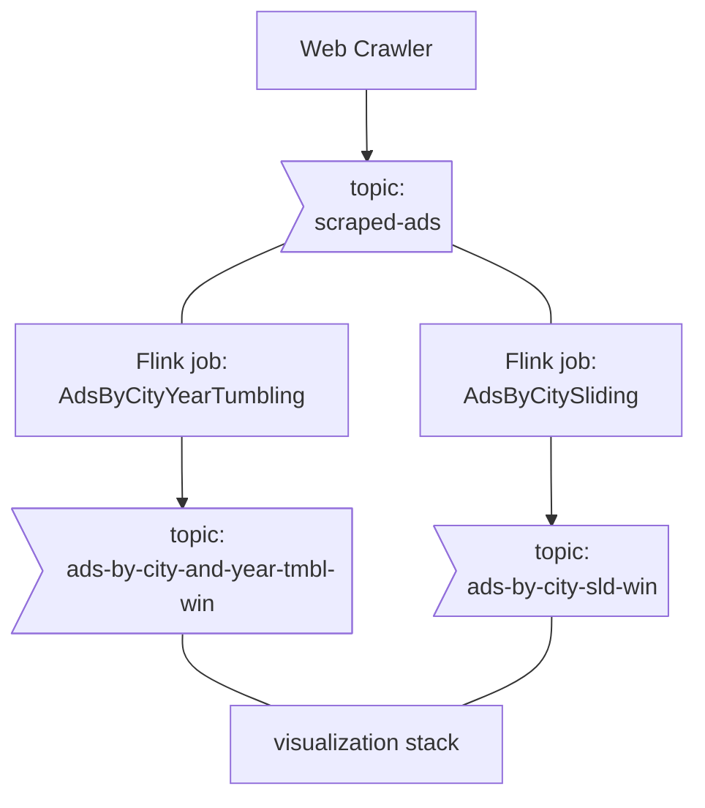

# flink-ads-processing
A little project for practising flink and kotlin.

## What do we have here

### Stack Components:
1. A **scrapy crawler** for collecting ads from a board website
2. A **kraft deployment** - stores the raw scraped-ads topic, and the output topics from flink aggregation jobs.
3. A **Flink cluster + client**, to submit and run 2 kotlin aggregation jobs.
4. The **Visualization stack** - promtail, loki and grafana (honestly I wanted grafana to read directly from kafka but the required [plugin](https://github.com/hoptical/grafana-kafka-datasource) relies on librdkafka and won't compile on arm64 :cry:)

## Helpful links (i.e. My code is copied from)
-  https://github.com/BarSnir/event_driven_freedom
-  https://github.com/katyagorshkova/kafka-kraft
-  https://github.com/dfdeshom/scrapy-kafka
-  https://github.com/valeriouberti/flink-with-kotlin

